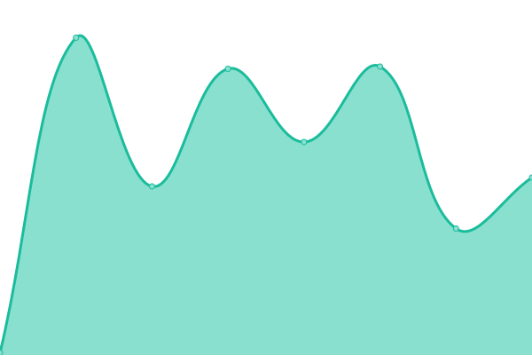
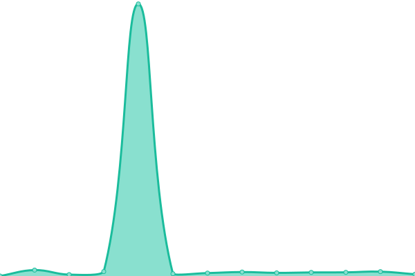
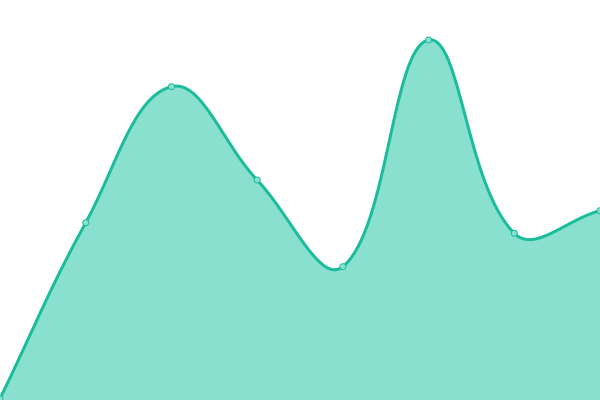
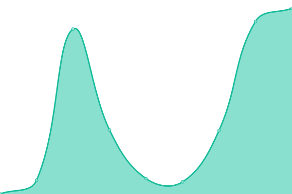
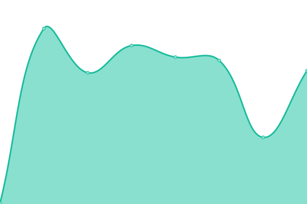
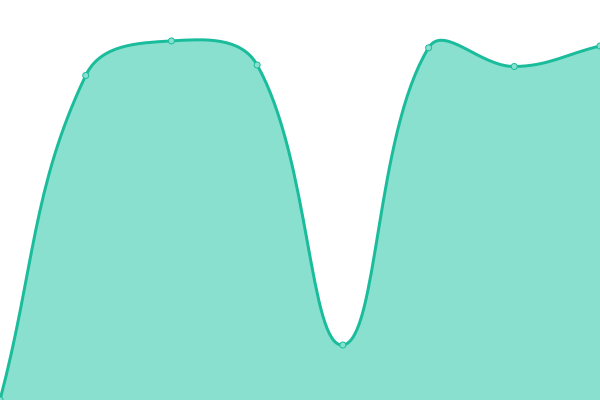

# [📈 Live Status](https://speedtest.akurai.to): <!--live status--> **🟩 All systems operational**

This repository contains the open-source uptime monitor and status page for [Ākura](akurai.to), powered by [Upptime](https://github.com/upptime/upptime).

With [Upptime](https://upptime.js.org), you can get your own unlimited and free uptime monitor and status page, powered entirely by a GitHub repository. We use [Issues](https://github.com/akuraito/upptime/issues) as incident reports, [Actions](https://github.com/akuraito/upptime/actions) as uptime monitors, and [Pages](https://speedtest.akurai.to) for the status page.

<!--start: status pages-->
<!-- This summary is generated by Upptime (https://github.com/upptime/upptime) -->
<!-- Do not edit this manually, your changes will be overwritten -->
<!-- prettier-ignore -->
| URL | Status | History | Response Time | Uptime |
| --- | ------ | ------- | ------------- | ------ |
|  AVATAR_PROXY | 🟩 Up | [avatar-proxy.yml](https://github.com/akuraito/upptime/commits/HEAD/history/avatar-proxy.yml) | 

 94ms
     
 | 

<a href="https://speedtest.akurai.to/history/avatar-proxy">100.00%</a>
    

|  BITWARDEN | 🟩 Up | [bitwarden.yml](https://github.com/akuraito/upptime/commits/HEAD/history/bitwarden.yml) | 

 234ms
     
 | 

<a href="https://speedtest.akurai.to/history/bitwarden">100.00%</a>
    

|  BLOG | 🟩 Up | [blog.yml](https://github.com/akuraito/upptime/commits/HEAD/history/blog.yml) | 

 142ms
     
 | 

<a href="https://speedtest.akurai.to/history/blog">98.87%</a>
    

|  BROADCASTCHANNEL | 🟩 Up | [broadcastchannel.yml](https://github.com/akuraito/upptime/commits/HEAD/history/broadcastchannel.yml) | 

 1912ms
     
 | 

<a href="https://speedtest.akurai.to/history/broadcastchannel">99.89%</a>
    

|  DC1 | 🟩 Up | [dc-1.yml](https://github.com/akuraito/upptime/commits/HEAD/history/dc-1.yml) | 

 195ms
     
 | 

<a href="https://speedtest.akurai.to/history/dc-1">100.00%</a>
    

|  HEIMDALLR | 🟩 Up | [heimdallr.yml](https://github.com/akuraito/upptime/commits/HEAD/history/heimdallr.yml) | 

 200ms
     
 | 

<a href="https://speedtest.akurai.to/history/heimdallr">100.00%</a>
    

|  WALINE | 🟩 Up | [waline.yml](https://github.com/akuraito/upptime/commits/HEAD/history/waline.yml) | 

 3050ms
     
 | 

<a href="https://speedtest.akurai.to/history/waline">98.87%</a>
    

<!--end: status pages-->

[**Visit our status website →**](https://speedtest.akurai.to)

## 📄 License

- Powered by: [Upptime](https://github.com/upptime/upptime)
- Code: [MIT](./LICENSE) © [Anand Chowdhary](https://anandchowdhary.com), supported by [Pabio](https://pabio.com)
- Data in the `./history` directory: [Open Database License](https://opendatacommons.org/licenses/odbl/1-0/)
